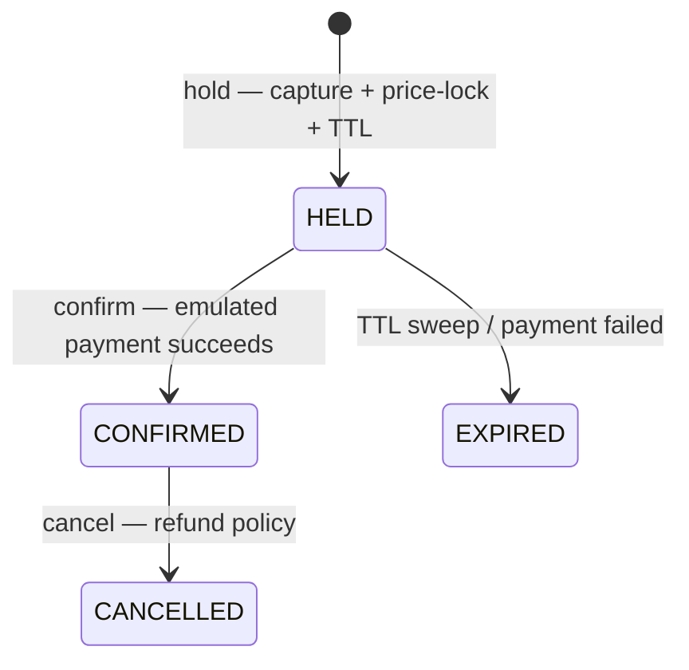
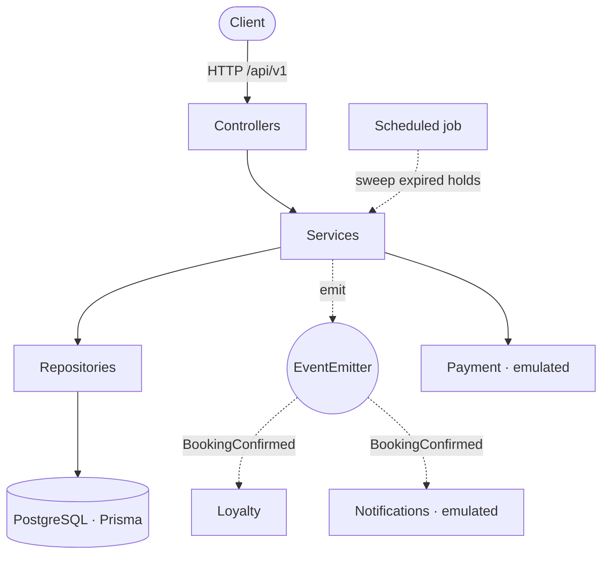

# Cinemafia — Layered Architecture

A NestJS backend for **Cinemafia**, a movie‑fan‑club cinema network, built in the
classic **Layered (N‑tier)** architecture: `Controller → Service → Repository`,
with business logic living in services.

This repository is one implementation in a portfolio series that builds the **same
domain across several server‑side architectures**, so the architectural
differences stand out against an unchanging domain. This is the **Layered
baseline** — the simplest of the set, and the one that freezes the shared REST
contract the other implementations conform to.

> Runs locally only; it is never deployed. The domain is a vehicle for
> demonstrating backend architecture, not a real business.

---

## The domain

Cinemafia is framed as a **club for film fans**, not a ticket marketplace. Two
ideas drive the whole model:

- **Curated sessions, not single screenings.** A *session* bundles one or more
  movies into a themed event — a genre block, a mixed combo, a marathon, a
  director's cut, a special event with guests, or a premiere.
- **Two independent axes of status.** Paid **membership** is the entry ticket to
  the club (tiers `BASIC` / `PLUS` / `PRO`, with a lifecycle and a guest quota).
  Earned **loyalty degree** is your standing in the inner circle — it accumulates
  from confirmed bookings and unlocks gated sessions and a larger guest quota. You
  *pay* to get in; you *earn* your way up.

The **signature domain logic** is resolving **entitlements** from
`(membership tier, loyalty degree)` — the effective guest quota, the member
discount, and whether a member may access a gated session. This resolution is the
clearest place to compare architectures, so it is deliberately isolated.

### Booking lifecycle

A booking captures seats (by tier) or a whole group cabin, holds them under a TTL,
and then moves through a small state machine:



Seat and cabin **contention** ("two people grab the last seat") is resolved in the
database: partial unique indexes guarantee a resource is held or confirmed by at
most one active booking per session.

---

## Features

- **Browse** curated sessions with per‑tier price previews; session detail with
  hall layout, ordered movie bundle, access gating and seat availability.
- **Entitlement resolution** from membership tier + loyalty degree (the signature).
- **Booking core**: hold → confirm → cancel, with eligibility and guest‑quota
  checks, price‑lock with member discount, and atomic seat/cabin capture.
- **Seat/cabin contention** guarded at the database level.
- **Emulated payment** at confirm (latency, configurable failure rate,
  idempotency); a failed charge expires the hold and releases the resources.
- **Hold expiry** as a scheduled job that sweeps stale holds back to `EXPIRED`.
- **In‑process domain events**: `BookingConfirmed` fans out to loyalty accrual and
  a notification — a reaction, not part of the booking transaction.
- **Club Notes**: a members‑only space to note attended sessions.
- **Support**: an emulated ticket endpoint that publishes an event.

---

## Architecture

Classic **N‑tier**, dependencies point strictly downward:



Key decisions that make this *honestly* Layered (and set up the contrast with the
later implementations in the series):

- **Business logic lives in services.** Entities are anemic (Prisma models / plain
  data); invariants are enforced in services, not in the models.
- **The entitlement resolution is a service method** (`EntitlementsService`) — a
  function of `(membership, degree)`. In richer architectures this would move
  behind a port or into a domain policy; here it is a plain service, on purpose.
- **Emulated boundaries are plain Nest providers** (`auth`, `payment`,
  `notifications`) — working fakes that simulate behavior, swappable via DI. No
  formal ports in the baseline.
- **The transaction boundary is `prisma.$transaction` inside the service**;
  state‑machine transitions run inside it.
- **A repository layer wraps Prisma** — the deliberate Layered exception that
  keeps SQL access in one place per module.

### Project structure

```
src/
├── common/                # config (zod), prisma, auth, payment, notifications,
│                          # events, health, exception filter
└── modules/
    ├── catalog/           # movies, sessions (bundles), halls, seats, cabins
    ├── entitlements/      # tier + degree → entitlements  ← signature
    ├── members/           # /me profile
    ├── booking/           # hold → confirm → cancel → expire (core)
    ├── loyalty/           # earned rank (accrues on BookingConfirmed)
    ├── club-notes/        # members-only notes
    └── support/           # emulated support tickets
```

Each module follows the canonical NestJS layout:
`*.controller.ts` / `*.service.ts` / `*.repository.ts` / `*.module.ts` + `dto/`.

---

## Tech stack

TypeScript · NestJS · Prisma 7 + PostgreSQL · Docker Compose · Vitest + supertest ·
ESLint (flat) + Prettier. No Redis or message broker — in‑process events,
Postgres‑backed hold TTL and seat contention. (Those belong to the distributed
implementations in the series.)

---

## Getting started

Requires Node 24 (see `.nvmrc`) and Docker.

```bash
cp .env.example .env        # local config (Postgres on host port 5442)
docker compose up -d        # start PostgreSQL
npm install
npm run prisma:generate     # generate the Prisma client
npm run prisma:migrate      # apply migrations
npm run db:seed             # load demo data (optional, recommended)
npm run start:dev           # http://localhost:3000
```

- **Swagger UI:** http://localhost:3000/docs · **OpenAPI spec:** `/docs-json`
- **Health probe:** http://localhost:3000/api/health
- **Tests:** `npm test` (Vitest + supertest; needs Postgres running)

### Trying it out

All authenticated routes accept an emulated identity via the `X-User-Id` header
(or a `Bearer` token). The seed creates demo members you can act as:

| User           | Membership | Loyalty | Notes                          |
| -------------- | ---------- | ------- | ------------------------------ |
| `u-boss`       | PRO        | 8       | full access, biggest quota     |
| `u-capo`       | PLUS       | 4       | mid tier                       |
| `u-associate`  | BASIC      | 1       | entry tier                     |
| `u-rookie`     | —          | 0       | no membership                  |
| `u-lapsed`     | EXPIRED    | 2       | membership no longer active    |

```bash
curl localhost:3000/api/v1/sessions
curl localhost:3000/api/v1/me -H "X-User-Id: u-boss"
```

A ready‑made **Bruno collection** in [`/bruno`](bruno) walks the whole vertical
flow (browse → me → hold → confirm → notes → cancel → support). Open it with the
Bruno app or the VS Code Bruno extension and select the `local` environment.

It represents one booking's lifecycle, so it is **stateful**:

- The easiest way is Bruno's **Run** (collection/folder runner) — it executes the
  requests in order, passes ids between them, and ends with `cancel`, which frees
  the seat, so you can run it again and again.
- Running requests **individually** also works: the read requests and `hold` are
  self‑sufficient (the `local` environment defaults to the seeded `demo-session` /
  `demo-seat`), while `confirm` / `cancel` need the `bookingId` produced by `hold`,
  so run those after it.
- The seed is a **full reset**: `npm run db:seed` (or `npm run db:reset`) wipes the
  domain tables and re‑inserts the same fixed demo dataset — it never accumulates
  duplicates. Run it whenever you want a clean slate (e.g. if a stale hold makes
  `hold` return `409`).

---

## API contract

This repository **defines** the canonical REST contract for the series. The
machine‑readable artifact is committed at
[`docs/openapi.json`](docs/openapi.json) (an export of `/docs-json`). Conventions:
global prefix `/api` with URI versioning (`/api/v1/...`); infra routes
(`/api/health`) are version‑neutral; money is integer cents; timestamps are ISO
8601; a single error shape `{ statusCode, error, message, path, timestamp }`.

| Area     | Endpoints                                                            |
| -------- | ------------------------------------------------------------------- |
| Catalog  | `GET /sessions`, `GET /sessions/:id`                                |
| Identity | `GET /me`                                                           |
| Booking  | `POST /bookings/hold` · `/:id/confirm` · `/:id/cancel`, `GET /bookings`, `GET /bookings/:id` |
| Club     | `GET/POST /sessions/:id/notes`                                      |
| Support  | `POST /support`                                                     |

---

## Emulated boundaries

Peripheral mechanisms that are not the subject of the demo are **working proxies
that emulate behavior**, not dead stubs — marked as demo‑boundaries in the code:

- **Auth** — issues/decodes a token, or accepts an `X-User-Id` header. No
  passwords, OTP or sessions.
- **Payment** — implements a charge/refund gateway that simulates latency, a
  configurable failure rate, and idempotency by key.
- **Notifications** — logs the "delivery" instead of sending anything.

Each is a plain Nest provider, so swapping the fake for a real adapter is a DI
change.

---

## Testing

- **Unit** on the core logic: entitlement resolution (tier × degree, expiry, caps,
  early‑access window) and payment idempotency/refund.
- **End‑to‑end** (supertest) on the canonical flow, the seat‑contention race,
  access gating, guest‑quota limits, payment failure, hold expiry and the
  `BookingConfirmed` reaction.

---

## Author

Vadim Stepanov — fullstack engineer.

- GitHub: [@vadim-stepanov](https://github.com/vadim-stepanov)
- LinkedIn: [linkedin.com/in/vadim-stepanov-98936150/](https://www.linkedin.com/in/vadim-stepanov-98936150/)
- Email: vadim.stepanov.mailbox@gmail.com

---

## License

MIT.
